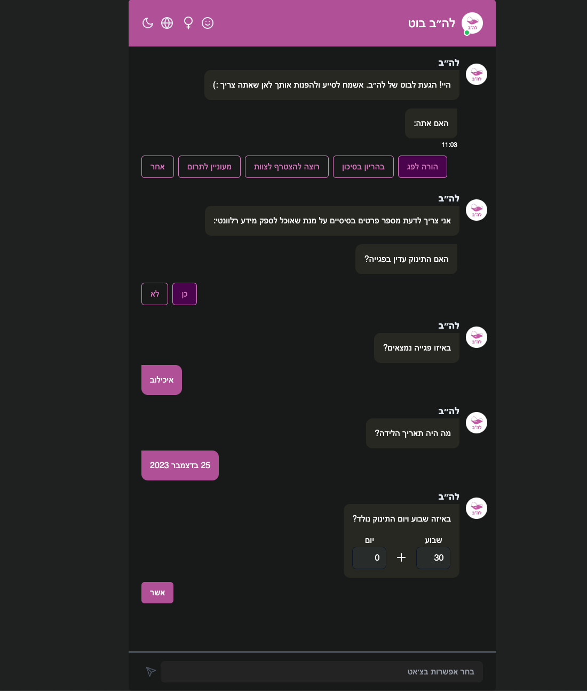

#  Lahav Assistance Bot

The project is about providing a chat bot functionality dedicated for Lahav - a non profit organization that helps to parents of premature babies.

The goal of this project is to minimize human interaction for frequently asked question and to receive quick response for such questions.

Bot is deployed [here](https://lahav-bot.netlify.app/)

[Lahav website](https://pagim.net/)

## Stack

Vite

React

React-intl

Typescript

Tailwind

Signals

## Contributing

1. Clone the repo
2. run `pnpm install`
3. run `pnpm dev`

